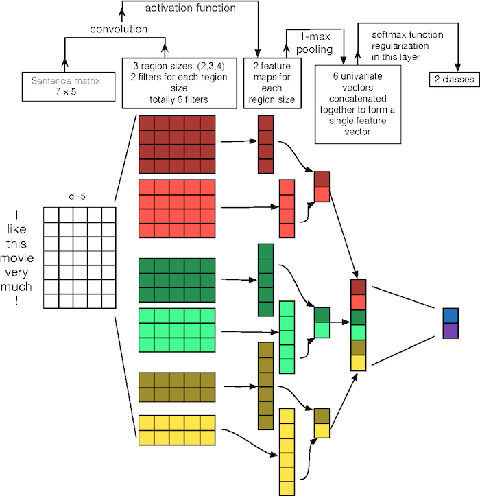
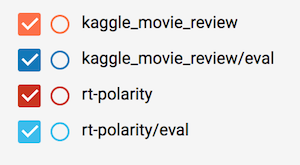

# text-cnn

This code implements [Convolutional Neural Networks for Sentence Classification](http://arxiv.org/abs/1408.5882) models.

- Figure 1: Illustration of a CNN architecture for sentence classification




## Requirements

- Python 3.6
- TensorFlow 1.4
- [hb-config](https://github.com/hb-research/hb-config) (Singleton Config)
- tqdm

## Project Structure

init Project by [hb-base](https://github.com/hb-research/hb-base)

    .
    ├── config                  # Config files (.yml, .json) using with hb-config
    ├── data                    # dataset path
    ├── notebooks               # Prototyping with numpy or tf.interactivesession
    ├── scripts                 # download or prepare dataset using shell scripts
    ├── text-cnn                # text-cnn architecture graphs (from input to logits)
        ├── __init__.py             # Graph logic
    ├── data_loader.py          # raw_date -> precossed_data -> generate_batch (using Dataset)
    ├── hook.py                 # training or test hook feature (eg. print_variables)
    ├── main.py                 # define experiment_fn
    └── model.py                # define EstimatorSpec      

Reference : [hb-config](https://github.com/hb-research/hb-config), [Dataset](https://www.tensorflow.org/api_docs/python/tf/data/Dataset#from_generator), [experiments_fn](https://www.tensorflow.org/api_docs/python/tf/contrib/learn/Experiment), [EstimatorSpec](https://www.tensorflow.org/api_docs/python/tf/estimator/EstimatorSpec)

- Dataset : [rt-polarity](https://github.com/yoonkim/CNN_sentence), [Sentiment Analysis on Movie Reviews](https://www.kaggle.com/c/sentiment-analysis-on-movie-reviews/data)

## Todo

- apply embed_type 
	- CNN-rand
	- CNN-static
	- CNN-nonstatic
	- CNN-multichannel

## Config

example: kaggle\_movie\_review.yml

```yml
data:
  type: 'kaggle_movie_review'
  base_path: 'data/'
  raw_data_path: 'kaggle_movie_reviews/'
  processed_path: 'kaggle_processed_data'
  testset_size: 25000
  num_classes: 5
  PAD_ID: 0

model:
  batch_size: 64
  embed_type: 'rand'     #(rand, static, non-static, multichannel)
  pretrained_embed: "" 
  embed_dim: 300
  num_filters: 256
  filter_sizes:
    - 2
    - 3
    - 4
    - 5
  dropout: 0.5

train:
  learning_rate: 0.00005
  
  train_steps: 100000
  model_dir: 'logs/kaggle_movie_review'
  
  save_checkpoints_steps: 1000
  loss_hook_n_iter: 1000
  check_hook_n_iter: 1000
  min_eval_frequency: 1000
```


## Usage

Install requirements.

```pip install -r requirements.txt```

Then, prepare dataset and train it.

```
sh prepare_kaggle_movie_reviews.sh
python main.py --config kaggle_movie_review --mode train_and_evaluate
```

### Experiments modes

:white_check_mark: : Working  
:white_medium_small_square: : Not tested yet.

- :white_check_mark: `evaluate` : Evaluate on the evaluation data.
- :white_medium_small_square: `extend_train_hooks` : Extends the hooks for training.
- :white_medium_small_square: `reset_export_strategies` : Resets the export strategies with the new_export_strategies.
- :white_medium_small_square: `run_std_server` : Starts a TensorFlow server and joins the serving thread.
- :white_medium_small_square: `test` : Tests training, evaluating and exporting the estimator for a single step.
- :white_check_mark: `train` : Fit the estimator using the training data.
- :white_check_mark: `train_and_evaluate` : Interleaves training and evaluation.


### Tensorboard

```tensorboard --logdir logs```

- Category Color



- rt-polarity (binary classification)


- kaggle_movie_review (multiclass classification)


## Reference

- [Implementing a CNN for Text Classification in TensorFlow](http://www.wildml.com/2015/12/implementing-a-cnn-for-text-classification-in-tensorflow/) by Denny Britz
- [Paper - Convolutional Neural Networks for Sentence Classification](http://arxiv.org/abs/1408.5882) (2014) by Y Kim
- [Paper - A Sensitivity Analysis of (and Practitioners' Guide to) Convolutional Neural Networks for Sentence Classification](https://arxiv.org/pdf/1510.03820.pdf) (2015) Y Zhang
